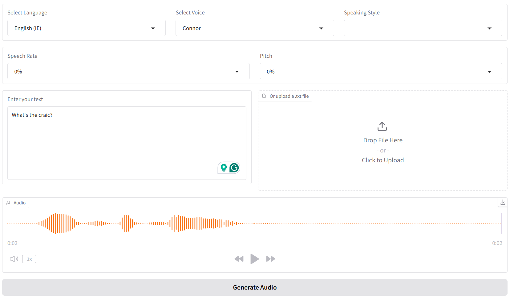

# SpeakItAI – Neural Text-to-Speech with Azure & Gradio

Convert text to speech using Microsoft Azure Neural Text-to-Speech (TTS) and a simple Gradio web interface.

---


*A simple, interactive interface for converting your text to realistic speech.*
---

## 🎯 Features

- Neural TTS with **UK English** and multilingual voices
- Adjustable **speaking style**, **rate**, and **pitch**
- Input via **textbox** or upload a `.txt` file
- Output as **.wav** file, played directly in the browser
- Dropdowns now **auto-populate** with default language, voice, and style
- Human-readable **language names** in the UI (e.g., "English (UK)" instead of `en-GB`) — falls back to code if name not defined
- Modular architecture – ready for expansion

---

## 🆓 Azure Free Tier

Microsoft Azure offers **500,000 characters per month free** for **Neural Text-to-Speech** on the **F0 (free) pricing tier**.

- ⚡ Billing is per character
- ✅ Free quota resets monthly
- 🧪 No credit card required to start

📖 More info: [Azure Speech Pricing](https://azure.microsoft.com/en-us/pricing/details/cognitive-services/speech-services/)

---

## 🌍 Language and Voice Support

Azure Neural TTS supports **140+ languages and dialects**, with many realistic male and female voices, including:

- 🇬🇧 British English
- 🇺🇸 American English
- 🇫🇷 French
- 🇩🇪 German
- 🇷🇺 Russian
- 🇨🇳 Chinese
- 🇪🇸 Spanish
- 🇮🇳 Hindi
- 🌐 And more

📖 Full voice list and styles:  
👉 [Azure Language & Voice Support](https://learn.microsoft.com/en-us/azure/ai-services/speech-service/language-support)

---

## 🚀 Setup Instructions

### 1. Clone the Repository

```bash
git clone https://github.com/loglux/SpeakItAI.git
cd SpeakItAI
```
### 🔐 Azure Setup (Required)

Before running this app, you need an active Azure Speech resource.

1. Go to the [Azure Portal](https://portal.azure.com/)
2. Create a **Speech** resource (Free F0 tier available)
3. Copy the **Key** and **Region** from the resource's "Keys and Endpoint" section
4. You will paste them into a `.env` file as shown below:

### 2. Create `.env` File

```bash
cp .env.example .env
```

Then fill in your Azure credentials:

```env
AZURE_KEY=your_azure_key
AZURE_REGION=your_azure_region
```

> 💡 Example region: `ukwest`, `eastus`, `westeurope`, etc.

---

### 3. Install Dependencies

Using virtual environment (recommended):

```bash
python -m venv venv
source venv/bin/activate   # On Windows: venv\Scripts\activate
pip install -r requirements.txt
```

---

### 4. Run the App

```bash
python app.py
```

---

## 📝 Usage Notes

- If both textbox and file are provided, the file takes priority.
- Only `.txt` files are accepted for upload.
- The output is saved and played as a `.wav` file.
- If a voice does not support styles, "default" will be used automatically.

---

## 📂 Project Structure

```
SpeakItAI/
├── app.py
├── .env.example
├── requirements.txt
├── README.md
├── audio_outputs/            # automatically created on runtime
│
├── screenshots/
│   └── interface.png         # UI preview
│
└── tts/
    ├── __init__.py
    ├── base.py               # optional: abstract provider interface
    └── azure/
        ├── __init__.py
        ├── core.py           # AzureTTS implementation
        ├── config.py         # language filters and display names
        ├── update_config.py  # fetch and build config.json
        └── config.json       # auto-generated by update_config.py
```

---

## 🧩 Configuration Notes

### Voice Configuration (`config.json`)

- Run `tts/azure/update_config.py` to fetch the latest Azure voice data.
- This generates a new `tts/azure/config.json` with all supported languages, voices, genders, and available styles.
- The app reads from `config.json` at runtime to populate the voice and style options.

### Language Filter (`config.py`)

- The app UI shows only the languages defined in `LANGUAGE_LABELS` in `config.py`.
- If `LANGUAGE_LABELS` is **empty**, the app will display **all languages using locale codes** (e.g., `fr-FR`, `hi-IN`).
- This gives you control over the dropdown list: show only selected languages or all available.
- To include a named language:

```python
LANGUAGE_LABELS = {
    "en-GB": "English (UK)",
    "ru-RU": "Russian",
    "pl-PL": "Polish",  
    # etc.
}
```

---

## 🨠 Architecture Note

The codebase is modular and ready for extension:
- Add new languages or accents in `tts/config.py`
- Replace the interface with FastAPI or Flask without touching `core.py`
- Support alternative providers like ElevenLabs, Bark, or Google Cloud TTS later

---

## 🛡 License

This project is licensed under the MIT License.
